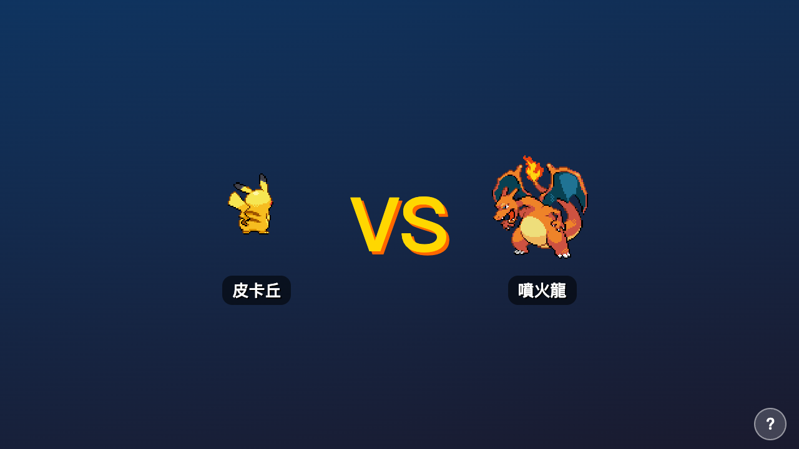

<div align="center">

# ⚡ 寶可夢學習大冒險 · Pokémon School Adventure

**繁體中文** | [English](#english)

一款讓小學生在寶可夢對戰中學習國語、英文、數學的 HTML5 單頁遊戲。
A single-file HTML5 game where elementary students learn through Pokémon battles.


</div>

---

## 目錄 Table of Contents
- [遊戲截圖](#遊戲截圖)
- [功能特色](#功能特色)
- [如何執行](#如何執行)
- [題庫結構](#題庫結構)
- [擴充題庫](#擴充題庫)
- [授權聲明](#授權聲明)
- [English](#english)

---

## 遊戲截圖

| 設定畫面 | 選擇隊伍 |
|:---:|:---:|
|  |  |

| 對戰 VS 動畫 | 戰鬥畫面 |
|:---:|:---:|
|  |  |

---

## 功能特色

- 🎮 **寶可夢對戰系統** — 答題才能攻擊，答對造成傷害，答錯輪到敵人攻擊
- 📚 **多年級題庫** — 大班 / 一年級 / 二年級 / 三年級，三科共 971+ 題
- 🔤 **兩種題型** — 選擇題（四選一）與是非題（正確 / 錯誤）
- 👾 **151 隻寶可夢可選** — 含神獸（超夢、夢幻、三神鳥），附搜尋篩選
- 🔄 **換陣容功能** — 每場勝利後可更換隊伍，原有寶可夢保留等級
- 📈 **進化進度顯示** — 戰鬥中即時顯示「還差幾級進化」
- 🎬 **帥氣對戰動畫** — VS 開場動畫（雙方寶可夢滑入、VS 爆炸彈出）
- ✨ **勝敗特效** — 擊倒金色閃光、全滅紅色震撼特效
- 💾 **三欄存檔** — 透過 File System Access API 存為本地 `.json` 檔，不怕瀏覽器清除
- 👤 **多用戶支援** — 三個存檔槽，各自獨立設定（年級、難度、計時等）
- ⚙️ **豐富設定** — 年級、答題計時、難度、語音朗讀（TTS）、背景音樂
- 🔊 **喇叭按鈕** — 每題附朗讀按鈕（`R` 鍵），隨時重聽題目
- ⌨️ **完整鍵盤支援** — 全程可用鍵盤操作，快捷鍵一目了然
- ❓ **情境說明** — 每個畫面都有繁體中文說明覆蓋層

---

## 如何執行

此遊戲使用 **File System Access API** 讀寫存檔，必須透過 HTTP 伺服器開啟（不支援 `file://` 協議）。

```bash
# 方式一：雙擊 start.sh（macOS，最簡單）
./start.sh

# 方式二：Python（內建，不需安裝）
cd pokemon-school
python3 -m http.server 8080
# 開啟瀏覽器：http://localhost:8080

# 方式三：Node.js
npx serve .
```

> **建議瀏覽器**：Chrome / Edge（完整支援）、Firefox 111+ / Safari 15.2+（部分支援）
> 若瀏覽器不支援 File System Access API，遊戲會自動 fallback 為 localStorage。

---

## 題庫結構

```
questions/
├── kinder/           # 大班
│   ├── math.json     # 129 題（加減法、數數、形狀、應用題）
│   ├── chinese.json  #  57 題（動物、顏色、家庭、反義詞）
│   └── english.json  #  57 題（字母、數字、顏色、動物）
├── grade1/           # 小學一年級
│   ├── math.json     # 107 題（20 以內加減、應用題、規律）
│   ├── chinese.json  #  55 題（反義詞、部首、季節、句型）
│   └── english.json  #  55 題（家人、問候語、文法）
├── grade2/           # 小學二年級
│   ├── math.json     # 153 題（九九乘法、三位數、時間、面積）
│   ├── chinese.json  #  55 題（近義詞、詞性、成語）
│   └── english.json  #  55 題（星期、be 動詞、教室物品）
└── grade3/           # 小學三年級
    ├── math.json     # 142 題（乘除法、幾何面積、大數計算）
    ├── chinese.json  #  60 題（成語、部首、比喻、因果句型）
    └── english.json  #  46 題（現在式、時態、問句詞、介系詞）
```

每題格式：

```json
// 選擇題（四選一）
{ "id": "g3m0001", "type": "mcq",
  "q": "7 × 8 = ?", "opts": ["48","54","56","63"], "a": 2,
  "tags": ["multiplication"] }

// 是非題
{ "id": "g3m0002", "type": "tf",
  "q": "9 × 9 = 81，這是正確的嗎？", "opts": ["正確","錯誤"], "a": 0,
  "tags": ["multiplication","tf"] }
```

外部來源題目可加上 `"source": "均一平台"` 欄位，遊戲會自動在題目畫面顯示出處連結。

---

## 擴充題庫

### 方式一：手動新增

直接編輯 `questions/<grade>/<subject>.json`，在 `questions` 陣列末尾新增物件。

### 方式二：執行產生器腳本

```bash
python3 scrapers/generate_questions.py
```

腳本會自動：
- 產生各年級數學題目（加減乘除、時間、幾何）
- 與現有題庫合併（不重複）
- 更新 `meta.count`

---

## 授權聲明

本專案採用 **CC BY-NC 4.0（創用CC 姓名標示─非商業性）**。

### 為什麼選擇 CC BY-NC 4.0？

本遊戲的 Pokémon 圖片與資料來自 **[PokéAPI](https://pokeapi.co)**（BSD 3-Clause）。
遊戲本身的程式碼、題庫與美術另外採用 **CC BY-NC 4.0**，原因如下：

- **允許**自由使用、修改與散布（供個人、教育、研究等非商業用途）
- **要求**保留著作權聲明與來源連結
- **禁止**將本專案或其衍生版本用於任何商業目的（付費服務、廣告盈利等）

**Pokémon and all related names are trademarks of Nintendo / Game Freak. This project is not affiliated with or endorsed by Nintendo.**

---
---

<a name="english"></a>

<div align="center">

## English

</div>

**Pokémon School Adventure** is a single-file HTML5 learning game for Taiwanese elementary school students (Kindergarten through Grade 3). Students answer questions in Math, Chinese, and English to power up their Pokémon in battle.

### Features

- 🎮 **Pokémon Battle System** — answer correctly to attack; wrong answers let the enemy strike back
- 📚 **Multi-grade Question Banks** — 4 grades × 3 subjects, 971+ questions total
- 🔤 **Two Question Types** — multiple choice (4 options) and true/false
- 👾 **All 151 Gen 1 Pokémon** — including legendaries (Mewtwo, Mew, legendary birds); searchable grid
- 🔄 **Party Swap** — replace team members after each victory; existing Pokémon keep their levels
- 📈 **Evolution Progress** — live "X levels until evolution" indicator in battle
- 🎬 **Battle Intro Animation** — VS screen with sliding sprites and explosive VS text
- ✨ **Win/Lose Effects** — gold flash on victory, red flash on defeat
- 💾 **3-Slot Save System** — saves to a local `.json` file via File System Access API
- 👤 **Multi-user Support** — 3 save slots with independent settings per user
- ⚙️ **Rich Settings** — grade, answer timer, difficulty, TTS narration, background music
- 🔊 **TTS Replay Button** — speaker button (or `R` key) re-reads any question aloud
- ⌨️ **Full Keyboard Support** — large, clear key badges on every button
- ❓ **Contextual Help** — Traditional Chinese help overlay on every screen

### Running the Game

The game requires an HTTP server (File System Access API does not work over `file://`):

```bash
# macOS — double-click start.sh, or:
./start.sh

# Python (built-in, no install needed)
cd pokemon-school && python3 -m http.server 8080
# Open: http://localhost:8080
```

**Recommended browsers**: Chrome / Edge (full support), Firefox 111+ / Safari 15.2+.
Falls back to localStorage if File System Access API is unavailable.

### Question Bank Format

```
questions/<grade>/<subject>.json
grades:   kinder | grade1 | grade2 | grade3
subjects: math   | chinese | english
```

```json
{ "id": "g3m0001", "type": "mcq",
  "q": "7 × 8 = ?", "opts": ["48","54","56","63"], "a": 2,
  "tags": ["multiplication"] }
```

Add `"source": "均一平台"` to any question to display a clickable attribution link in-game.

To add questions, edit the JSON files directly or run the generator:

```bash
python3 scrapers/generate_questions.py
```

### License

This project is licensed under **CC BY-NC 4.0 (Creative Commons Attribution-NonCommercial 4.0 International)**.

Pokémon data and sprites are sourced from [PokéAPI](https://pokeapi.co) (BSD 3-Clause). The game code, question banks, and assets are separately licensed under CC BY-NC 4.0 to prevent commercial copying — anyone is free to use, adapt, and share this game for educational or personal purposes, but **commercial use is prohibited**.

**Pokémon and all related names are trademarks of Nintendo / Game Freak. This project is not affiliated with or endorsed by Nintendo.**

---

<div align="center">

Made with ❤️ for kids learning | Powered by [PokéAPI](https://pokeapi.co) (free & open source)

</div>
