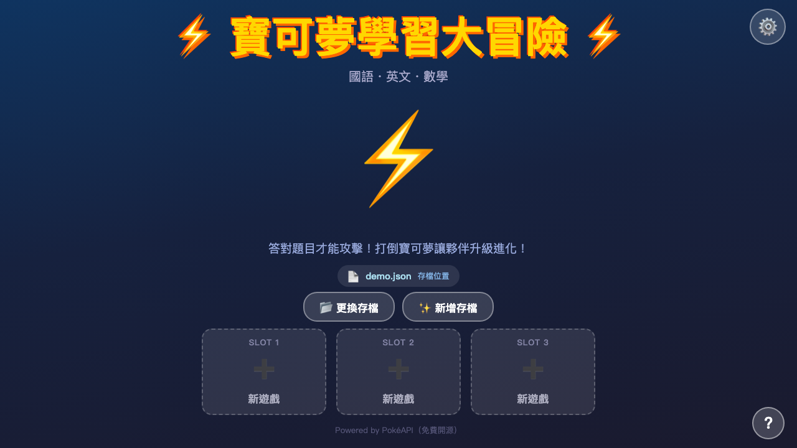
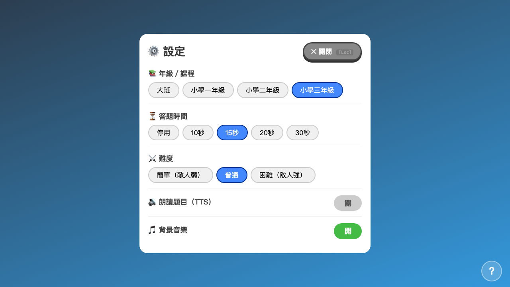
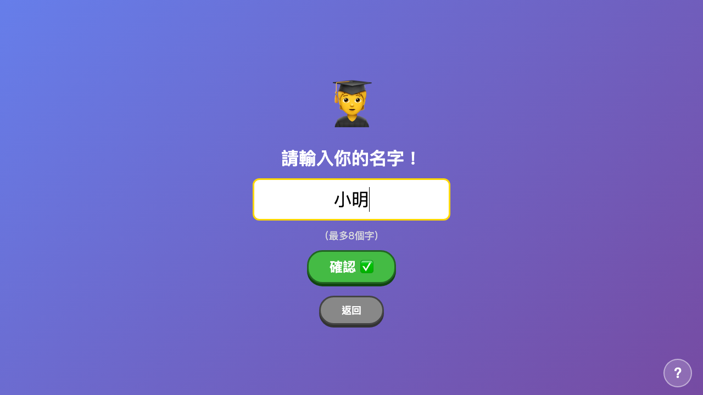
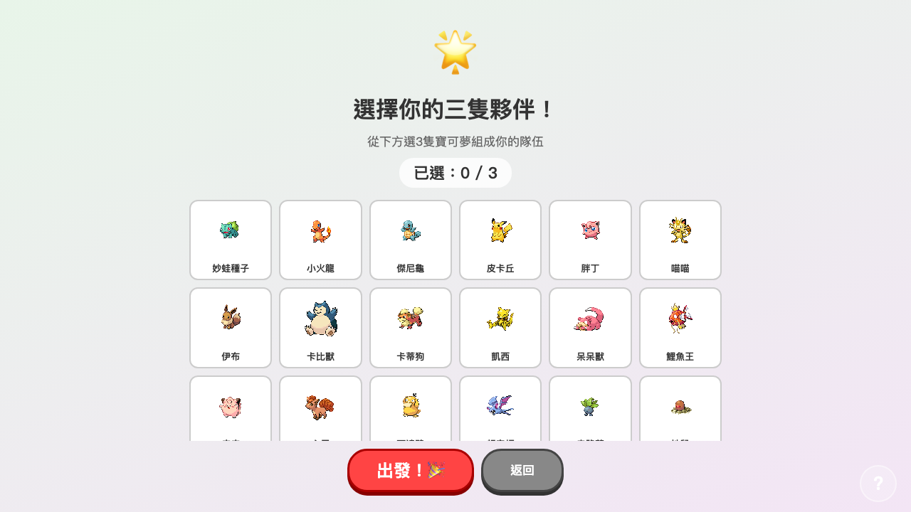
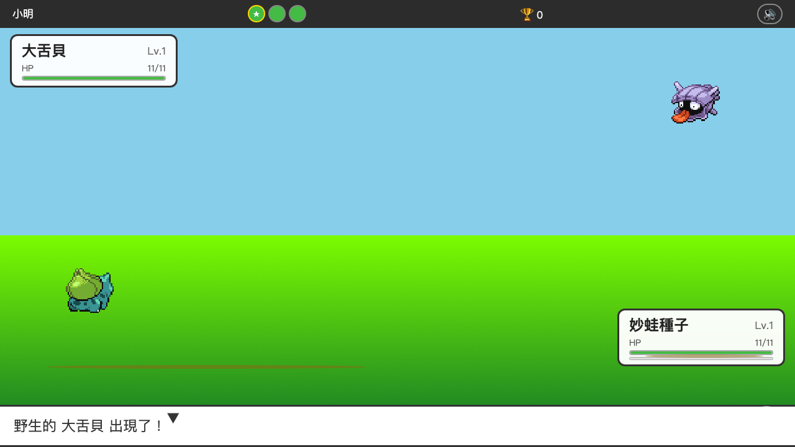

<div align="center">

# ⚡ 寶可夢學習大冒險 · Pokémon School Adventure

**繁體中文** | [English](#english)

一款讓小學生在寶可夢對戰中學習國語、英文、數學的 HTML5 單頁遊戲。  
A single-file HTML5 game where elementary students learn through Pokémon battles.



</div>

---

## 目錄 Table of Contents
- [遊戲截圖](#遊戲截圖)
- [功能特色](#功能特色)
- [如何執行](#如何執行)
- [題庫結構](#題庫結構)
- [擴充題庫](#擴充題庫)
- [授權聲明](#授權聲明)
- [English](#english)

---

## 遊戲截圖

| 設定畫面 | 輸入名字 |
|:---:|:---:|
|  |  |

| 選擇隊伍 | 戰鬥畫面 |
|:---:|:---:|
|  |  |

---

## 功能特色

- 🎮 **寶可夢對戰系統** — 答題才能攻擊，答對造成傷害，答錯輪到敵人攻擊
- 📚 **多年級題庫** — 大班 / 一年級 / 二年級 / 三年級，三科各 40–130 題
- 🔤 **兩種題型** — 選擇題（四選一）與是非題（正確 / 錯誤）
- 👾 **三隻夥伴隊伍** — 升級、進化、倒下後下一場自動復活
- 💾 **三欄存檔** — 透過 File System Access API 存為本地 `.json` 檔，不怕瀏覽器清除
- ⚙️ **豐富設定** — 年級、答題計時、難度、語音朗讀（TTS）、背景音樂
- ⌨️ **鍵盤快捷鍵** — 全程可用鍵盤操作（詳見遊戲內 `？` 說明按鈕）
- 📖 **情境說明** — 每個畫面都有繁體中文說明覆蓋層

---

## 如何執行

此遊戲使用 **File System Access API** 讀寫存檔，必須透過 HTTP 伺服器開啟（不支援 `file://` 協議）。

```bash
# 方式一：Python（最簡單）
cd pokemon-school
python3 -m http.server 8080
# 開啟瀏覽器：http://localhost:8080

# 方式二：Node.js
npx serve .

# 方式三：VS Code Live Server 擴充功能
```

> **建議瀏覽器**：Chrome / Edge（完整支援）、Firefox 111+ / Safari 15.2+（部分支援）  
> 若瀏覽器不支援 File System Access API，遊戲會自動 fallback 為 localStorage。

---

## 題庫結構

```
questions/
├── kinder/           # 大班
│   ├── math.json     # 109 題（加減法、數數、形狀）
│   ├── chinese.json  #  42 題（動物、顏色、家庭）
│   └── english.json  #  42 題（字母、數字、顏色）
├── grade1/           # 小學一年級
│   ├── math.json     #  87 題（20 以內加減、乘法入門）
│   ├── chinese.json  #  40 題（反義詞、部首、季節）
│   └── english.json  #  40 題（家人、問候語、顏色）
├── grade2/           # 小學二年級
│   ├── math.json     # 133 題（九九乘法、三位數、時間）
│   ├── chinese.json  #  40 題（近義詞、詞性、昆蟲分類）
│   └── english.json  #  40 題（星期、be 動詞、教室物品）
└── grade3/           # 小學三年級
    ├── math.json     # 122 題（乘除法、幾何、大數計算）
    ├── chinese.json  #  45 題（反義詞、部首、交通工具）
    └── english.json  #  16 題（現在式、疑問詞）
```

每題格式：

```json
// 選擇題（四選一）
{ "id": "g3m0001", "type": "mcq",
  "q": "7 × 8 = ?", "opts": ["48","54","56","63"], "a": 2,
  "tags": ["multiplication"] }

// 是非題
{ "id": "g3m0002", "type": "tf",
  "q": "9 × 9 = 81，這是正確的嗎？", "opts": ["正確","錯誤"], "a": 0,
  "tags": ["multiplication","tf"] }
```

---

## 擴充題庫

### 方式一：手動新增

直接編輯 `questions/<grade>/<subject>.json`，在 `questions` 陣列末尾新增物件。

### 方式二：執行產生器腳本

```bash
python3 scrapers/generate_questions.py
```

腳本會自動：
- 產生各年級數學題目（加減乘除、時間、幾何）
- 與現有題庫合併（不重複）
- 更新 `meta.count`

### 方式三：擴充腳本產生其他科目

編輯 `scrapers/generate_questions.py`，參考 `extra_grade3_english()` 的寫法新增函式，  
並在 `main()` 的 `generators` 字典中登記即可。

---

## 授權聲明

本專案採用 **BSD 3-Clause License**。

### 為什麼選擇 BSD 3-Clause？

本遊戲的 Pokémon 圖片與資料來自 **[PokéAPI](https://pokeapi.co)**，  
PokéAPI 本身即採用 BSD 3-Clause License。  
為了與上游資料來源保持一致的授權精神：

- **允許**自由使用、修改與散布（包括商業用途）
- **要求**保留著作權聲明與免責聲明
- **不允許**使用本專案名稱為衍生品背書
- 相較於 GPL/LGPL，BSD 的「弱著作權」限制最少，適合教育性開源工具

---
---

<a name="english"></a>

<div align="center">

## English

</div>

**Pokémon School Adventure** is a single-file HTML5 learning game for Taiwanese elementary school students (Kindergarten through Grade 3). Students answer questions in Math, Chinese, and English to power up their Pokémon in battle.

### Features

- 🎮 **Pokémon Battle System** — answer correctly to attack; wrong answers let the enemy strike back
- 📚 **Multi-grade Question Banks** — 4 grades × 3 subjects, 756+ questions total
- 🔤 **Two Question Types** — multiple choice (4 options) and true/false
- 👾 **Party of 3 Pokémon** — level up, evolve, and revive between battles
- 💾 **3-Slot Save System** — saves to a local `.json` file via File System Access API
- ⚙️ **Rich Settings** — grade, answer timer, difficulty, TTS narration, background music
- ⌨️ **Full Keyboard Support** — play without touching the mouse
- ❓ **Contextual Help** — Traditional Chinese help overlay on every screen

### Running the Game

The game requires an HTTP server (File System Access API does not work over `file://`):

```bash
# Python
cd pokemon-school && python3 -m http.server 8080
# Open: http://localhost:8080
```

**Recommended browsers**: Chrome / Edge (full support), Firefox 111+ / Safari 15.2+.  
Falls back to localStorage if File System Access API is unavailable.

### Question Bank Format

```
questions/<grade>/<subject>.json
grades:   kinder | grade1 | grade2 | grade3
subjects: math   | chinese | english
```

```json
{ "id": "g3m0001", "type": "mcq",
  "q": "7 × 8 = ?", "opts": ["48","54","56","63"], "a": 2,
  "tags": ["multiplication"] }
```

To add questions, edit the JSON files directly or run the generator:

```bash
python3 scrapers/generate_questions.py
```

### License

This project is licensed under the **BSD 3-Clause License** — the same license used by [PokéAPI](https://pokeapi.co), from which all Pokémon data and sprites are sourced.

The BSD 3-Clause license was chosen to align with the upstream data source and to impose minimal restrictions on educators and developers who wish to adapt this tool.

**Pokémon and all related names are trademarks of Nintendo / Game Freak. This project is not affiliated with or endorsed by Nintendo.**

---

<div align="center">

Made with ❤️ for kids learning | Powered by [PokéAPI](https://pokeapi.co) (free & open source)

</div>
